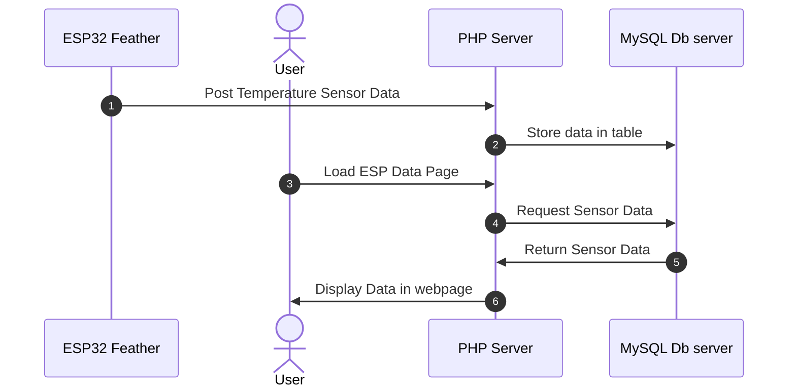

# Basic Sequence of events

This is a very simple overview of the process of the ESP32 Feather posting data to the PHP server.

It is the same process for each sensor posting and receiving data from the server.

