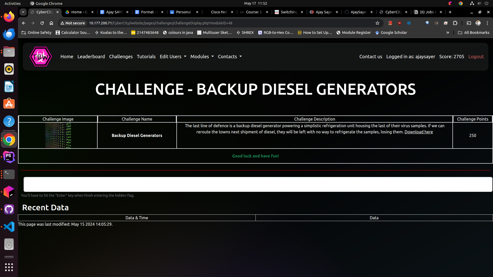

# Backup Diesel Generators Guide

## Overview

Backup Diesel Generators is a challenge where you make use of binary manipulation* to alter the delivery address of a shipment
of diesel. 

The Biolab has had its electricity cut off and is relying on its backup diesel generators in order to sustain the condition
of the volatile virus prototype. However, they are running out of diesel and make an order for some more. By changing the
delivery address, the fuel would never arrive, starving the Biolab of power.

'*' Although initially intended to be a binary manipulation challenge, most tools represent binary in human readable hex,
which simplifies the challenge significantly.

## Steps
### Step 1:

(Temporary steps taken from challenge code:)

To complete it open it in a hex editor, the online one avaliable here: https://hexed.it/ is perfectly capable. 

Use the search feature and search for something like "mog" in order to
find the default address, (123 Mogworth St, Cybercity). 

Replace each character accordingly (rewrite the address) to "456 Grimace Shake Rd, Ohio". This will
cause the address comparison function to work correctly and the program will download the correct PDF accordingly. 

Note that is named the same as the defualt address one that does not contain the CTF{} flag.

## Skill Learned

## User Experiences

## Developer Experiences

### How it works

TODO: 