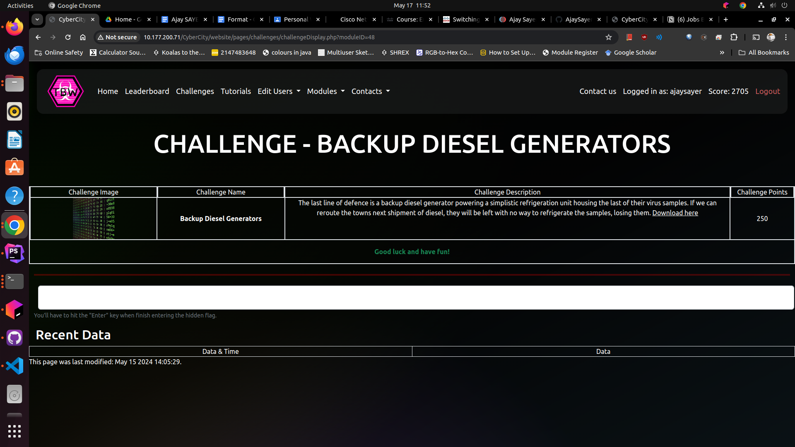

# Backup Diesel Generators

## Overview

Backup Diesel Generators is a challenge where you make use of binary manipulation* to alter the delivery address of a shipment
of diesel.

The Biolab has had its electricity cut off and is relying on its backup diesel generators in order to sustain the condition
of the volatile virus prototype. However, they are running out of diesel and make an order for some more. By changing the
delivery address, the fuel would never arrive, starving the Biolab of power.

'*' Although initially intended to be a binary manipulation challenge, most tools represent binary in human readable hex,
which simplifies the challenge significantly.

## How it works

A hex editor is a special tool that lets you look at and change the raw data inside a file. Imagine a file as a big box of LEGO bricks. Normally, you see the finished LEGO model (like a picture or a document), but a hex editor lets you see and change each individual brick.

Here’s how it works in simple terms:

Viewing Raw Data: When you open a file in a hex editor, it shows you the raw data in a format called hexadecimal (or hex). This is like seeing the LEGO bricks laid out in a grid, where each brick has a specific number.

Editing Data: You can change these numbers directly. It’s like swapping out one LEGO brick for another. This can be useful if you need to fix or modify something very specific in the file.

No Translation: Unlike regular text editors that show you readable text, a hex editor shows you the exact data stored in the file without any translation. It’s like seeing the blueprint of the LEGO model instead of the finished product12.

